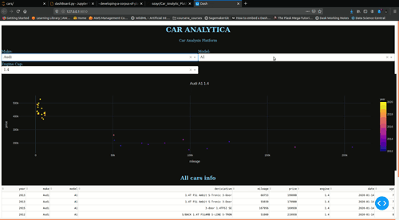

# Car Analytics app 




### simple dashboard app created with data scraped using scrapy

#### Dependencies

* dash 
* dash_table 
* glob
* plotly.express
* pandas

#### Instructions 
```
git clone https://github.com/ozayr/Car_Analytic_Platform.git
cd Car_Analytic_Platform
python dashboard.py
```

Data scaped from 3 sites carshop,usedcardeals and driveit 
